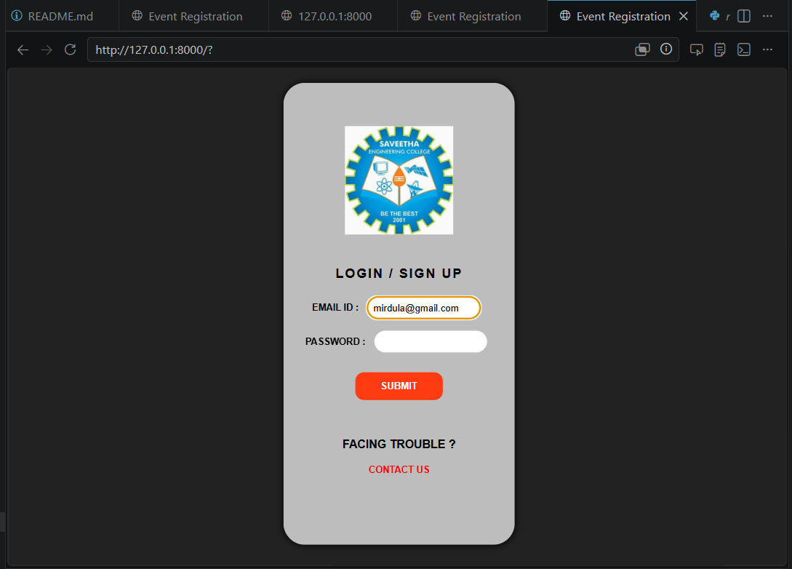
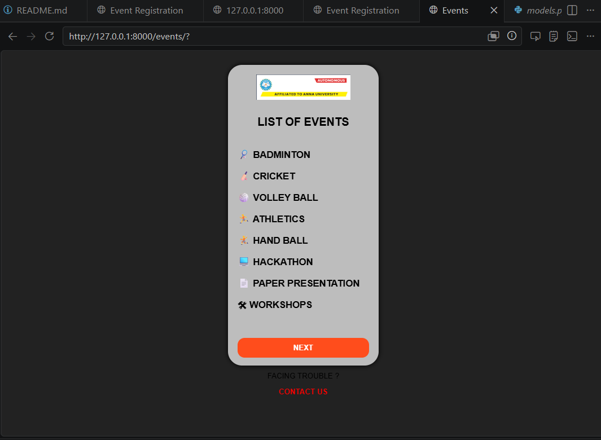
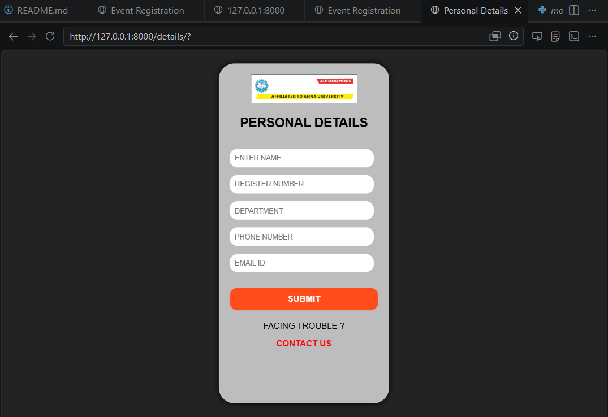
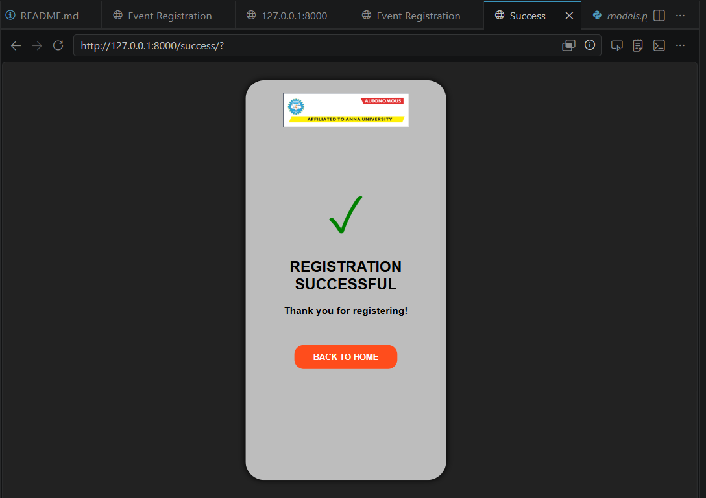

# Ex08 Event Registration Web Application
## Date:

## AIM:
To design, develop and deploy a web application for event registration using Figma UI tool.

## UI DESIGN TOOL:
Figma

## DESIGN STEPS:

### Step 1:
Use frames to represent screens or sections.

### Step 2:
Add column grids for consistent spacing and alignment.

### Step 3:
Insert shapes, text, buttons, and icons.

### Step 4:
Use Auto Layout for flexible, responsive design.

### Step 5:
Define color, text, and effect styles globally for consistency.

### Step 6:
Name layers logically and group related elements.

### Step 6:
Link frames to show navigation or interactions.

### Step 7:
Select the specific frame while generating code using Anima plugin.

## CODE:
index.html
```

<!DOCTYPE html>
<html>
<head>
<title>Event Registration</title>

<style>
body{
    margin:0;
    font-family: Arial, sans-serif;
    background:#222;
}

.mobile{
    width:280px;
    height:600px;
    margin:30px auto;
    border-radius:30px;
    background:
      linear-gradient(rgba(255,255,255,0.7),rgba(255,255,255,0.7)),
      url("/static/images/bg.jpg");
    background-size:cover;
    padding:20px;
    box-shadow:0 0 10px black;
    text-align:center;
}

.logo{
    width:150px;
    margin-top:40px;
}

h2{
    margin-top:40px;
    font-size:18px;
    letter-spacing:2px;
}

input{
    width:140px;
    padding:8px;
    border:none;
    border-radius:20px;
    margin:8px;
}

label{
    font-size:13px;
    font-weight:bold;
}

button{
    background:#ff3b12;
    color:white;
    border:none;
    padding:12px 35px;
    border-radius:12px;
    margin-top:20px;
    font-weight:bold;
}

a{
    color:red;
    font-weight:bold;
    text-decoration:none;
    font-size:13px;
}
</style>
</head>

<body>

<div class="mobile">

    

    <h2>LOGIN / SIGN UP</h2>

    <form action="/events/" method="get">
        <label>EMAIL ID :</label>
        <input type="email"><br>

        <label>PASSWORD :</label>
        <input type="password"><br>

        <button type="submit">SUBMIT</button>
    </form>

    <br><br>
    <p><b>FACING TROUBLE ?</b></p>
    <a href="#">CONTACT US</a>

</div>

</body>
</html>
```


event.html
```


<!DOCTYPE html>
<html>
<head>
<title>Events</title>

<style>

body{
    margin:0;
    font-family:Arial;
    background:#222;
}

.mobile{
    width:280px;
    height:600px;
    margin:30px auto;
    border-radius:30px;

    background:
    linear-gradient(rgba(255,255,255,0.7),rgba(255,255,255,0.7)),
    url("");

    background-size:cover;
    padding:20px;
    box-shadow:0 0 10px black;
}

.logo{
    width:220px;
}

h2{
    text-align:center;
    margin-top:30px;
    font-size:24px;
}

ul{
    list-style:none;
    padding:0;
    margin-top:40px;
}

li{
    margin:18px 0;
    font-size:20px;
    font-weight:bold;
}

button{
    width:100%;
    padding:12px;
    background:#ff4d1c;
    color:white;
    border:none;
    border-radius:15px;
    margin-top:40px;
    font-size:16px;
    font-weight:bold;
}

.contact{
    text-align:center;
    margin-top:30px;
}

a{
    color:red;
    text-decoration:none;
    font-weight:bold;
}

</style>
</head>

<body>

<div class="mobile">

<center>

</center>

<h2>LIST OF EVENTS</h2>

<ul>
    <li>🏸 BADMINTON</li>
    <li>🏏 CRICKET</li>
    <li>🏐 VOLLEY BALL</li>
    <li>🏃 ATHLETICS</li>
    <li>🤾 HAND BALL</li>
    <li>💻 HACKATHON</li>
    <li>📄 PAPER PRESENTATION</li>
    <li>🛠 WORKSHOPS</li>
</ul>

<form action="/details/">
    <button type="submit">NEXT</button>
</form>

<div class="contact">
    <p>FACING TROUBLE ?</p>
    <a href="#">CONTACT US</a>
</div>

</div>

</body>
</html>
```

details.html
```


<!DOCTYPE html>
<html>
<head>
<title>Personal Details</title>

<style>

body{
    margin:0;
    background:#222;
    font-family:Arial;
}

.mobile{
    width:280px;
    height:600px;
    margin:30px auto;
    border-radius:30px;

    background:
    linear-gradient(rgba(255,255,255,0.7),rgba(255,255,255,0.7)),
    url("");

    background-size:cover;
    padding:20px;
    box-shadow:0 0 10px black;
}

.logo{
    width:200px;
}

h2{
    text-align:center;
    margin-top:20px;
}

input{
    width:90%;
    padding:10px;
    margin-top:15px;
    border:none;
    border-radius:15px;
}

button{
    width:100%;
    padding:12px;
    background:#ff4d1c;
    color:white;
    border:none;
    border-radius:15px;
    margin-top:30px;
    font-size:16px;
    font-weight:bold;
}

.contact{
    text-align:center;
    margin-top:20px;
}

a{
    color:red;
    text-decoration:none;
    font-weight:bold;
}

</style>
</head>

<body>

<div class="mobile">

<center>

</center>

<h2>PERSONAL DETAILS</h2>

<form action="/success/">

<input type="text" placeholder="ENTER NAME">

<input type="text" placeholder="REGISTER NUMBER">

<input type="text" placeholder="DEPARTMENT">

<input type="text" placeholder="PHONE NUMBER">

<input type="email" placeholder="EMAIL ID">

<button type="submit">
SUBMIT
</button>

</form>

<div class="contact">
<p>FACING TROUBLE ?</p>
<a href="#">CONTACT US</a>
</div>

</div>

</body>
</html>
```

success.html
```


<!DOCTYPE html>
<html>
<head>
<title>Success</title>

<style>
body{
    margin:0;
    background:#222;
    font-family:Arial;
}

.mobile{
    width:280px;
    height:600px;
    margin:30px auto;
    border-radius:30px;
    background:
    linear-gradient(rgba(255,255,255,0.7),rgba(255,255,255,0.7)),
    url("");
    background-size:cover;
    padding:20px;
    box-shadow:0 0 10px black;
    text-align:center;
}

.logo{
    width:200px;
    margin-top:30px;
}

.tick{
    font-size:80px;
    color:green;
    margin-top:80px;
}

h2{
    color:black;
    margin-top:20px;
}

p{
    font-weight:bold;
}

button{
    padding:12px 30px;
    background:#ff4d1c;
    color:white;
    border:none;
    border-radius:15px;
    margin-top:30px;
    font-weight:bold;
}
</style>
</head>

<body>

<div class="mobile">


<div class="tick">✓</div>

<h2>REGISTRATION SUCCESSFUL</h2>

<p>Thank you for registering!</p>

<form action="/">
    <button type="submit">BACK TO HOME</button>
</form>

</div>

</body>
</html>
```


## OUTPUT:







DEVELOPED BY: MIRDULA D

REGISTRATION NO. 212225040234

## RESULT:
The program to design, develop and deploy a web application for event registration using Figma UI tool is completed successfully.
